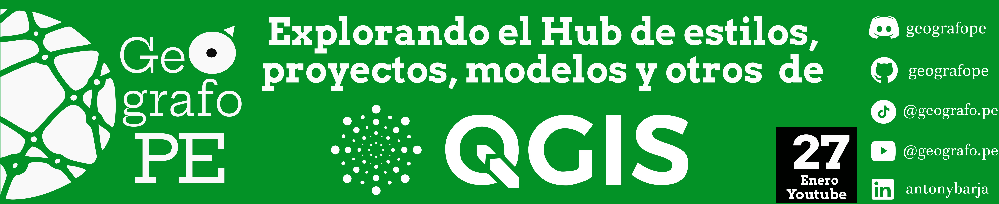
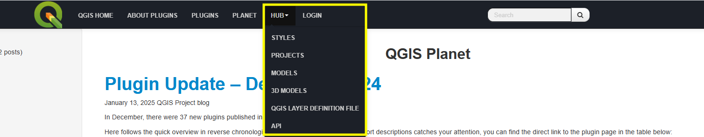

✨ Este repositorio 📁 encontrarás una guía paso a paso para explorar el `Hub` de `QGIS` 🚀, donde encontrarás recursos adicionales 🛠️ que te ayudarán a llevar tu flujo de trabajo a un siguiente nivel, en este `Hub` exploraremos más estilos y diseños para tus mapas, modelos 3D, plantillas prefinidas y muchos más 🌍.

Para este video usaremos la siguiente herramienta:

- [QGIS](https://www.qgis.org/): Software de Sistema de Información Geográfica libre y de código abierto que permite manipular, editar, analizar y visualizar datos espaciales.

## ⚫ Pasos a realizar 

1. Primer paso: Dirigirnos al `Hub` de `QGIS`.
      

2. Segundo paso: Obtener el recurso de interés.
3. Tercer paso: Instalar el recurso dentro `QGIS`.
4. Cuarto paso: Visualizar el resultado del recurso en `QGIS`.

Todo el proceso desarrollado esta explicado al detalle en el siguiente video de YouTube 🎥.

¡Enteráte más y aprender conmigo! 🔍💡 Suscríbete, activa las notificaciones 🔔 y únete a la comunidad que ama el software libre de código abierto. 🌟🌍 👇
- https://www.youtube.com/@geografope

- https://www.tiktok.com/@geografope

- https://www.linkedin.com/in/antonybarja/

## ⚫ Referencias:
 - http://qgis-hub.fast-page.org/?i=1
